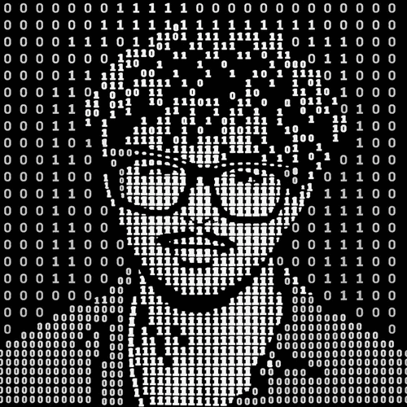

  

<h1 align="center">Tejas Naladala</h1>

<strong>I build machines for problems I take personally, and experiments for claims I don't trust.</strong>

  <a href="https://tejasnaladala.com">website</a>
  &nbsp;&middot;&nbsp;
  <a href="https://tejasnaladala.com/work">work</a>
  &nbsp;&middot;&nbsp;
  <a href="https://tejasnaladala.com/research">research</a>
  &nbsp;&middot;&nbsp;
  <a href="https://tejasnaladala.com/blog">"Un"Supervised</a>
  &nbsp;&middot;&nbsp;
  <a href="https://scholar.google.com/citations?user=7901XFQAAAAJ">Google Scholar</a>

I'm 19. I build and research full-time.

I grew up around a family farm in a small coastal village in South India, where crops, chemicals, machines, and money were never abstract. Now I study Electrical & Computer Engineering and Applied Mathematics at the [University of Washington](https://www.washington.edu/).

My work sits between AI/ML and physical systems: model evaluation, autonomous research, plasma reactors, embedded sensing, and the unglamorous verification that tells you whether any of it actually works. The projects look unrelated; the habit is the same: build the artifact, write down what would change my mind, and keep the failure modes in the result.

## Problems I took personally

[**R0 Systems**](https://fuckchlorine.com/) replaces bulk chlorine dosing with sanitizer generated on demand from ambient air, water, and electricity. I built the continuous-flow machine stack from the plasma reactor and 20 kV electronics through firmware, fluidics, fabrication, validation, and field deployment.

[**VISIONS '26 / Ocean CV**](https://interactiveoceans.washington.edu/07/2026/tejas-naladala/naladala_tejas_v26/) is work in progress on provenance-aware computer vision for underwater methane-plume bubble flux. It began during fieldwork with ROV Jason at Axial Seamount and Southern Hydrate Ridge; no performance claim is published yet.

## Experiments, failures included

[**MTEB-Gym**](https://github.com/embeddings-benchmark/MTEB-gym-v2/pulls?q=is%3Apr+author%3Atejasnaladala+is%3Amerged) is the official label-free embedding-selection project. I contributed nine merged changes across validation, uncertainty estimation, caching, deterministic parallelism, and failure handling.

[**AgentBreed**](https://github.com/tejasnaladala/agentbreed) tests whether multi-agent performance depends more on the available configuration space or the search algorithm. The current result is a deterministic synthetic pilot; the pre-registered real-LLM replication has not been run yet.

[**Procedural-Maze RL Baselines**](https://github.com/tejasnaladala/maze-rl-baselines) studies why reward-driven agents miss policies that simple heuristics can find. I found a validation flaw in the original study and am rebuilding the evaluation around a proper held-out protocol.

[**Connectome Architecture Benchmark**](https://github.com/tejasnaladala/connectome-bpu) asks whether biological wiring helps after density, weights, graph realizations, and trainable components are actually controlled. I withdrew the first headline when those controls did not hold.

## Other systems

[**Mimic**](https://github.com/tejasnaladala/mimic) - browser teleoperation and imitation learning for a simulated Franka arm.

[**Engram**](https://github.com/tejasnaladala/engram) - online learning with local plasticity, persistent memory, and safety gates.

[**Forge**](https://github.com/tejasnaladala/Forge) - provider-agnostic agents with tools, memory, budgets, and observability.

[**WireML**](https://github.com/tejasnaladala/wireml) - a terminal workbench for CLIP/DINOv2 features, lightweight heads, held-out evaluation, and linear-head ONNX export.

[**delphi-quant**](https://github.com/tejasnaladala/delphi-quant) - a verification harness for systematic strategies and legible rejection.

## Published work

Three peer-reviewed plasma-engineering papers, 57 citations, and an h-index of 3. The papers and current manuscripts live on [Google Scholar](https://scholar.google.com/citations?user=7901XFQAAAAJ); the machines, fieldwork, and less GitHub-shaped parts live on [my website](https://tejasnaladala.com/work).

For the person behind all of it, read [about](https://tejasnaladala.com/about). For questionable decisions, read ["Un"Supervised](https://tejasnaladala.com/blog).

  <a href="https://www.linkedin.com/in/tejasnaladala">LinkedIn</a>
  &nbsp;&middot;&nbsp;
  <a href="mailto:naladala@uw.edu">naladala@uw.edu</a>

